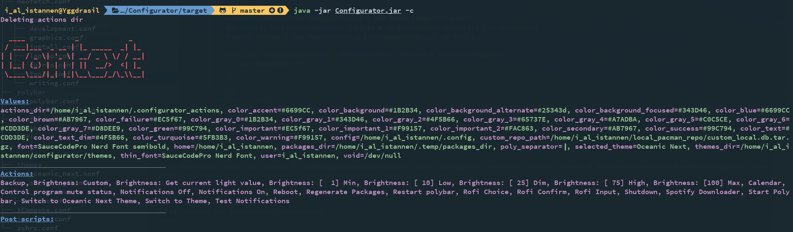
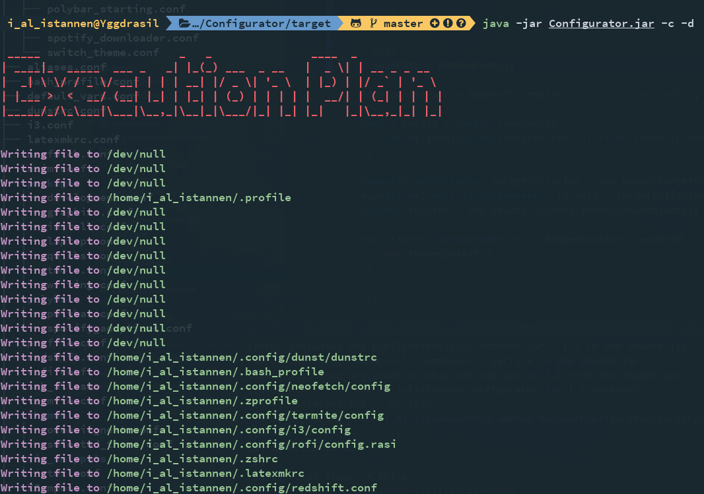
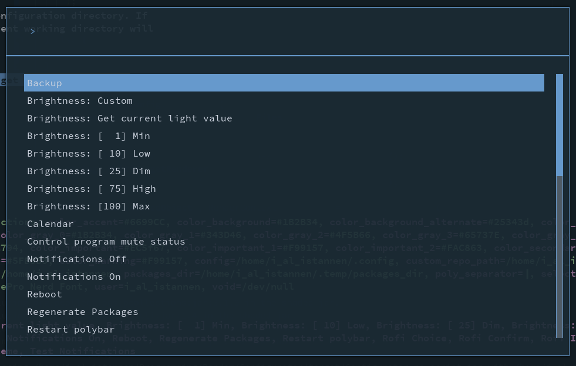

# About

This is a small helper for configuration files ("Dotfiles") on linux systems. It is written in java and optionally uses Graal for AOT compilation to a native image.  

The config file format contains all constructs the mini-DSL allows as well as an example for each.
Additionally a few example dotfiles are provided at the end to showcase various features of the system. They might also serve as a starting point for your own tweaks.

# TOC
1. [About](#about)
2. [TOC](#toc)
3. [Features](#features)
   * [Config DSL](#config-dsl)
   * [Phases](#phases)
4. [Installation](#installation)
5. [Config file format](#config-file-format)
   * [General layout](#general-layout)
   * [Variable assignment](#variable-assignment)
   * [Variable expansion](#variable-expansion)
   * [Command output](#command-output)
   * [Actions](#actions)
   * [Reload actions](#reload-actions)
   * [Calling an action](#calling-an-action)
   * [Calling an action inline, e.g. to eval the result](#calling-an-action-inline--eg-to-eval-the-result)
   * [If statements](#if-statements)
     + [Operators](#operators)
   * [Post scripts](#post-scripts)
   * [Scripts](#scripts)
   * [Main Configurator config file (`.configurator`)](#main-configurator-config-file---configurator--)
6. [Example directory layout](#example-directory-layout)
7. [Command line usage](#command-line-usage)
8. [Screenshots](#screenshots)
   + [Sample execution result](#sample-execution-result)
   + [Dry run start](#dry-run-start)
   + [Run Action](#run-action)
9. [Sample files](#sample-files)
   + [`default_vars.conf`](#default_varsconf)
   + [`actions/brightness.conf`](#actionsbrightnessconf)
   + [`themes/selected_theme.conf`](#themesselected_themeconf)
   + [`actions/switch_theme.conf`](#actionsswitch_themeconf)

# Features

## Config DSL

* Actions (scripts in whatever language a shebang can fix) that can be executed using an automatically generated run script via rofi.

* Variable declaration, overwriting and replacement. This allows you to centrally define important variables like the config dir, colours, themes and more

* Shell command interpolation. You can assign variables based on the output of shell commands. This can be useful for e.g. getting for the user name (`whoami`)

* Calling previously defined actions

* Post run scripts that will be run after the config files were processed

## Phases

Each config file is assigned to a *phase*. These phases are then executed in the order specified in the `.configurator` config file. This allows you to have different steps in the execution, e.g. saving the selected theme in a variable and then only loading the theme matching that name or relying on variables that were added before.
You can also use this to rely on the results of earlier config files.

# Installation
1. Run `mvn clean package` while in the root directory of the project.
2. Optionally run `./generate_native.sh` to generate native images. Those will also be placed in `./target`
4. Create a `.configurator` file in your configuration directory (see [Example directory layout](#example-directory-layout) for the basic layout)
5. Create your config files (see the [General layout](#general-layout))
6. Run the artifacts in `./target`, either via `java -jar` for the jars and `./<name>` for the native images. The native images start up a lot faster and use less memory.

# Config file format

## General layout
(`<>` are placeholders for your text and should not be copied)
```bash
Phase          : <name>
Target Path    : <where the config file should end up. You can use variables here>
Command prefix : <the prefix all commands need to start with. Ideally something that is a comment in whatever language the config file uses>

<your config>
```

## Variable assignment
`<command prefix> <name> = <value>`
E.g.
```bash
# test = Hello world!
```

## Variable expansion
`{{$name}}`
E.g.
```bash
# test = Hello world!
{{$test}}
Greeting: {{$test}}!1!!
```

## Command output
`{{!command}}`
E.g.
```bash
{{!echo "How are you?"}}
{{!echo "How are you?"}} - Quite fine :)
```

## Actions
Actions will be written to the `actions_dir` variable (so define that one!). This also means that you can send each action to `/dev/null` in their `Target Path`.
All actions will be made executable, so I'd advice you to add the `actions_dir` to the path somewhere: `export PATH="${PATH}:{{$actions_dir}}"`.
```bash
<command prefix> action Name
<command prefix> end action
```
E.g.

```bash
# action My first action
#!/bin/sh
echo "Hello world"
# end action
```

If you define an action using `action*` and `end action*`, the action *will not be listed in Run Action dialog*. This can be nice for auxiliary actions.

## Reload actions
Reload actions are just like actions, but there is some special handling for them: They start with `reload`, not `action`, and a `Reload all` action that calls all registered reload actions will automatically be generated.

```bash
<command prefix> reload Name
<command prefix> end reload
```
E.g.

```bash
# reload Reload i3
#!/bin/sh
i3-msg reload
# end reload
```

## Calling an action
```bash
<command prefix> (<Action name>) (<arguments>)
```
E.g.

```bash
# call (My first action) ('This is ignored in my action :(')
```

## Calling an action inline, e.g. to eval the result
`{{|(<Action name>) (<arguments>)}}`
E.g.
```bash
# $() evaluates the result, that is default shell behaviour. The {{|}} is the interpolation
The output was $({{|(My first action) ()}})
```

## If statements
```bash
<command prefix> if (<left side>) <operator> (<right side>)
<comamnd prefix> end if
```
E.g.

```bash
# if ({{$test}}) == (Hello world)
echo "It was hello"
# end if

# if (You) != (You)
echo "Never executed"
# end if
```

### Operators

| Operator        | Description                          |
| --------------- | ------------------------------------ |
| `==`            | Checks for equality, ignoring case   |
| `===`           | Checks for equality, respecting case |
| `~=`            | Checks for equality with a regex     |
| `!=`            | Checks for inequality                |
| `>`             | Mathematical `>` for integers        |
| `<`             | Mathematical `<` for integers        |
| `||`            | Logical `OR`                         |
| `&&`            | Logical `AND`                        |

## Post scripts
```bash
<command prefix> execute
<content>
<command prefix> end execute
```
E.g.

```bash
# execute
#!/bin/sh
echo "I will be run after all config files and actions are written"
# end execute
```

## Scripts
You can also directly embed JS scripts that can modify the used `RenderContext`, directly registering actions, variables, scripts or querying them.

Note that script support must be enabled (i.e. the `-scripts`) variant of the native image or jar file. This increases the executable size dramatically.
```bash
<command prefix> script js
<content>
<command prefix> end script
```
E.g.
```bash
# script js
context.storeValue("Hey", 20);
console.log("I got the variables " + context.getAllValues());
# end script
```

| Method                                          | Description                                                                     |
| -------------------------------------------     | ------------------------------------------------------------------------------- |
| <T> T getValue(String key)                      | Returns a value by its name.                                                    |
| <T> Optional<T> getValueOpt(String key)         | Returns a value by its name.                                                    |
| <T> RenderContext storeValue(String key, T val) | Stores a given value.                                                           |
| Map<String, Object> getAllValues()              | Returns all values.                                                             |
| RenderContext storeAction(Action action)        | Stores a new action.                                                            |
| Action getAction(String name)                   | Returns the action with the given name.                                         |
| Optional<Action> getActionOpt(String name)      | Returns the action with the given name.                                         |
| List<Action> getAllActions()                    | Returns all actionS.                                                            |
| RenderContext merge(RenderContext other)        | Merges the two contexts. Keeps the keys of this context if there are conflicts. |
| RenderContext addPostScript(String content)     | Adds a new script to be run at the end.                                         |
| List<String> getAllPostScripts()                | Returns all scripts that will be run at the end.                                |

## Main Configurator config file (`.configurator`)
```yaml
phases:
 - <first phase>
 - <second phase>
 - <third phase>
 - ...
```

# Example directory layout
```
.
├── .configurator
├── test.conf
└── actions
   └── brightness.conf
```

# Command line usage
```
Usage: configurator [-c] [-d] [-f] [-h] [-n] [-p] [-t <target directory>]
A simple program to help organize dotfiles.
 -c,--print-context                   If present the program will print
                                      the final context after all
                                      rendering steps were completed.
 -d,--dry                             Whether the program should run
                                      without altering files.
 -f,--print-contents                  Whether the program should print the
                                      whole file contents when running in
                                      dry mode.
 -h,--help                            Prints the help
 -n,--strip-color                     If present the program will not
                                      color its output.
 -p,--preserve-actions-dir            If present the program will not
                                      delete the action dir and preserve
                                      manually added actions
 -t,--target-dir <target directory>   The path to the configuration
                                      directory. If not given the current
                                      working directory will be used
Made by <I Al Istannen>
```

# Screenshots
### Sample execution result


### Dry run start


### Run Action


# Sample files

### `default_vars.conf`
```bash
Phase: load-defaults
Target path: /dev/null
Command prefix: #
# user = {{!whoami}}
# home = {{!echo ~}}
# config = {{$home}}/.config
# actions_dir = {{$home}}/.configurator_actions
# void = /dev/null
# themes_dir = {{$home}}/configurator/themes

# packages_dir = {{$home}}/.temp/packages_dir
# custom_repo_path = {{$home}}/local_pacman_repo/custom_local.db.tar.gz
```

### `actions/brightness.conf`
```bash
Phase: actions
Target path: {{$void}}
Command prefix: #

# vim: ft=sh

# action Brightness: [  1] Min
#!/usr/bin/env bash
light -S 1
# end action

# action Brightness: [ 10] Low
#!/usr/bin/env bash
light -S 10
# end action

# action Brightness: [ 25] Dim
#!/usr/bin/env bash
light -S 25
# end action

# action Brightness: [ 75] High
#!/usr/bin/env bash
light -S 75
# end action

# action Brightness: [100] Max
#!/usr/bin/env bash
light -S 100
# end action

# action Brightness: Custom
#!/usr/bin/env bash
VALUE=$({{|(Rofi Input) ('What brightness do you want? [0, 100]')}})
if [ $? -ne 0 ]; then
    exit
fi
light -S "$VALUE"
# end action

# action Brightness: Get current light value
#!/usr/bin/env bash
rofi -e "$(light)"
# end action
```

### `themes/selected_theme.conf`
```bash
Phase: select-theme
Target path: {{$void}}
Command prefix: #
# selected_theme = Oceanic Next
```

### `actions/switch_theme.conf`
```bash
Phase: actions
Target path: {{$void}}
Command prefix: #

# vim: ft=sh
# action Switch to Theme
if [[ "$1" == "" ]]; then
    THEME_NAME=$({{|(Rofi Input) ('Enter the name of the theme')}})
    if [[ $? -ne 0 ]] ; then
        exit
    fi
else
    THEME_NAME="$1"
fi
sed -Ei "s/selected_theme =.+/selected_theme = $THEME_NAME/" {{$themes_dir}}/selected_theme.conf
# end action

# action Switch to Oceanic Next Theme
# call (Switch to Theme) ('Oceanic Next')
# end action
```
